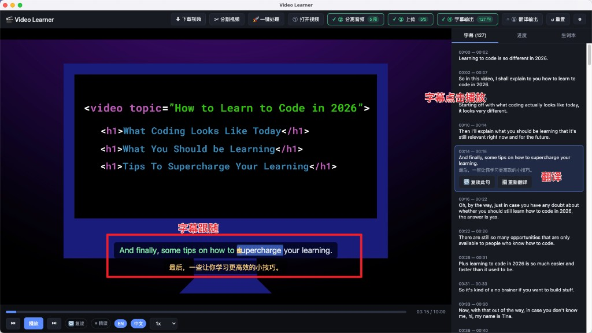
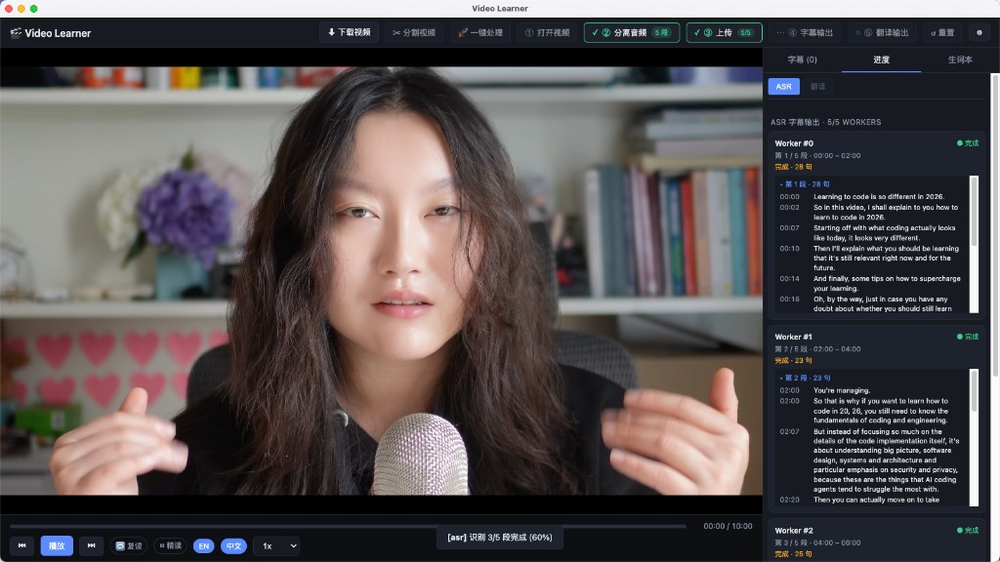

# Video Learner

基于 Electron 的桌面视频英语学习工具，针对从 YouTube 等平台下载的本地视频。

## 界面预览

播放 + 双语字幕 + Karaoke 高亮 + 单句翻译：



一键处理中的 ASR 并行进度视图（多 Worker 同时跑 Paraformer-v2）：



## 功能

- ✂ **分割视频**：按固定时长(默认 10 分钟,可选 5/15/20/30/60 或自定义)把长视频切成多段(FFmpeg `-c copy` 不重编码,速度快),输出到 `<视频名>.parts/` 目录
- 📂 打开本地视频（`.webm` / `.mp4` / `.mkv` 等）
- 🚀 **一键处理**：顶部「打开视频」左侧按钮,点击后先弹出视频选择框,然后自动串联 `打开视频 → 分离音频 → 上传 OSS → 字幕输出(ASR)`,不做翻译;会自动读取该视频上次的 pipeline 状态,已完成的步骤自动跳过(断点续跑)
- 🎧 **一键生成字幕**：本地 FFmpeg 分离音频 → 上传阿里云 OSS → 千问（Paraformer-v2）ASR → SRT
- 🎤 **Karaoke 字幕**：Paraformer 返回字级时间戳,视频播放时字幕会随语音从左到右染色(进行中金黄渐变 → 已读淡绿),旁路存在 `<视频名>.words.json`
- 🈯 **双语字幕**：可开关英文 / 中文（翻译由 qwen-turbo 完成）
- 🈯 **单句翻译**：字幕列表选中一句后，「复读此句」右侧出现「翻译此句」按钮，单句走 qwen-turbo 翻译并自动写回 `<视频名>.bilingual.srt`
- 🔁 **整句复读**：当前句无限循环，按 `R` 切换
- ⏸ **精读模式**：句末自动暂停
- 📖 **生词本**：字幕上点单词 → 一键加入，SQLite 本地持久化
- ⬇ **yt-dlp 命令助手**：弹窗里填 URL + 选浏览器，自动生成 `yt-dlp --cookies-from-browser ...` 命令,一键复制
- ⚡ 快捷键：`Space` 播放 / `A`,`D` 上/下句 / `R` 复读 / `E` 英文 / `Z` 中文 / `P` 精读

## 目录结构

```
app/
├── electron/               # 主进程(Node)
│   ├── main.ts             # 入口 + 窗口 + app-media 协议
│   ├── preload.ts          # contextBridge 暴露 window.api
│   ├── ipc/register.ts     # 所有 IPC handler
│   └── services/
│       ├── ffmpeg.ts       # 调用系统 ffmpeg,静音感知切分音频
│       ├── oss.ts          # 阿里云 OSS 上传 + 签名 URL
│       ├── asr.ts          # DashScope Paraformer-v2 ASR(含字级时间戳)
│       ├── subtitle.ts     # SRT 解析/生成 + qwen-turbo 翻译 + words.json 旁路
│       ├── db.ts           # better-sqlite3 生词本
│       └── config.ts       # electron-store 配置(AccessKey 等)
└── src/                    # 渲染进程(React)
    ├── App.tsx
    ├── components/
    │   ├── Player.tsx         # <video>+rAF 全局时钟广播
    │   ├── ControlBar.tsx
    │   ├── SubtitleOverlay.tsx # 逐词 karaoke 渐变高亮
    │   ├── CueList.tsx
    │   ├── WordBook.tsx
    │   ├── YtDlpModal.tsx   # yt-dlp 命令生成器
    │   ├── VideoSplitModal.tsx # 按固定时长切分视频(默认 10 分钟)
    │   └── SettingsModal.tsx
    ├── hooks/
    │   └── videoTime.ts    # 全局当前播放时间(ms)广播,避免每帧 re-render
    └── store/player.ts     # zustand
```

## Karaoke 字幕原理

Paraformer-v2 的 ASR 结果默认带 **字级时间戳**(英文逐单词、中文逐字),在 `sentences[].words[]` 里:`{ begin_time, end_time, text, punctuation }`。

数据链路:

1. `electron/services/asr.ts` 把 `words` 一并读出到 `SubtitleCue.words`
2. `electron/ipc/register.ts` ASR pipeline 给 `words` 也加上 segment 的 `offsetMs`(和句级时间戳一样修正到全片坐标)
3. `electron/services/subtitle.ts`:SRT 本身无法承载字级时间戳,所以把 words 序列化到旁路的 `<视频名>.words.json`。加载 SRT 时自动按 cue id / startMs 匹配合并回来
4. 渲染侧:
   - `src/hooks/videoTime.ts` 是一个极简广播器;`Player.tsx` 用 `requestAnimationFrame` 循环把 `video.currentTime*1000` push 进去(仅播放中跑,暂停即停)
   - `SubtitleOverlay.tsx` 每个 word 渲染成两层叠放的 `<span.kw-bg>` + `<span.kw-fg>`,在 useEffect 里订阅时钟,**直接 DOM ref 改 className + CSS 变量 `--kw-progress`**,不触发 React re-render,性能稳

视觉规则:

- 未读:灰白
- 进行中(.kw--active):金黄色从左到右填充内部 `.kw-fg` 宽度,跟着语音推进
- 已读(.kw--passed):淡绿色,和进行中的金黄区分开

旧字幕(没有 words.json)自动降级回原来的按空格切分渲染,不会挂。

## 前置依赖

- Node 18+（已测 Node 24）
- 本地安装 `ffmpeg`（macOS: `brew install ffmpeg`；或设置环境变量 `FFMPEG_PATH`）
- 阿里云 OSS：一个 Bucket + AccessKey（子账号最佳，只给 `oss:PutObject` + `oss:GetObject` 权限）
- 阿里云百炼（DashScope）API Key：https://bailian.console.aliyun.com/

## 启动

```bash
cd app
npm install
npm run dev
```

首次启动后点 **⚙ 设置**，填入：
- DashScope API Key
- OSS region / bucket / accessKeyId / accessKeySecret

这些配置会存在 `electron-store` 默认路径下（macOS：`~/Library/Application Support/video-learner/config.json`），**不会**写到代码仓库里。

## 使用流程

1. 点「打开视频」选择你的 `.webm` 文件
2. 点「生成+翻译」→ 会依次：
   1. FFmpeg `silencedetect` 扫描全片静音区间
   2. 按目标段长(默认 2 分钟) ± 容差(默认 24 秒)挑最近的静音作为切点,抽成 16kHz 单声道 WAV,尽量不把一句话切成两半
   3. 上传到 OSS（私有 bucket，2 小时签名 URL）
   4. 提交给千问 Paraformer-v2（异步任务，轮询）
   5. 拉取结果、qwen-turbo 批量翻译
   6. 保存为 `原视频名.bilingual.srt`（再次打开时自动加载）
3. 英文字幕每个单词都可点击 → 加入生词本
4. 左右字幕列表可点击跳转，任意一句可复读

## 打包分发

```bash
npm run dist
```

产物在 `release/`。macOS 发布需要 Apple Developer 账号做公证（个人自用可跳过）。

## 注意事项

- OSS 建议用**子账号 + 仅此 bucket 的最小权限策略**，AccessKey 不要用主账号。
- 千问 Paraformer 对视频时长有限制（录音文件识别支持到 12 小时，单文件 2GB 以内），本项目对超长视频未做分片。
- 字幕翻译走 qwen-turbo（性价比），也可以改成 qwen-plus 以提升质量。
- 渲染进程通过自定义协议 `app-media://<绝对路径>` 读本地视频，避免 `file://` 在 Chromium 里的限制。
